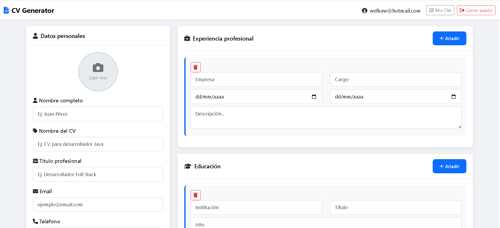
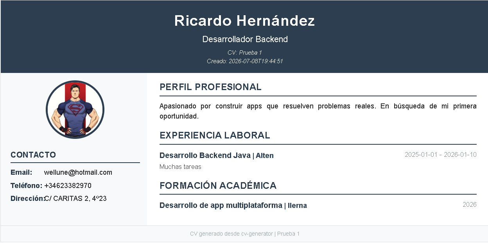

# CV Generator

Aplicación web full-stack desarrollada con **Spring Boot 4.1.0** que permite a los usuarios crear, editar, previsualizar y descargar en PDF sus currículums vitae de forma profesional.

<!-- PROJECT SHIELDS -->


---

## Capturas de la Aplicación

### Editor de CV (Dashboard)


### Vista Previa del CV Generado


---

## Características Principales

- **Registro e Inicio de Sesión** -- Autenticación segura con Spring Security y BCrypt
- **CRUD Completo de CVs** -- Crear, listar, editar y eliminar currículums
- **Fotografía de Perfil** -- Subida de imágenes con previsualización en tiempo real (hasta 10MB)
- **Entradas Dinámicas** -- Añadir/experiencias laborales y formación de forma dinámica desde el formulario
- **Múltiples CVs** -- Cada usuario puede crear y gestionar varios CVs con nombres personalizados
- **Vista Previa Profesional** -- Plantilla HTML de dos columnas optimizada para impresión
- **Generación de PDF** -- Descarga del CV en formato PDF con un solo clic
- **Aislamiento de Datos** -- Cada usuario solo accede a sus propios CVs

---

## Stack Tecnológico

| Capa | Tecnología | Detalles |
|------|-----------|----------|
| Lenguaje | **Java 17** | Records, Stream API, lambda expressions |
| Framework | **Spring Boot 4.1.0** | Auto-configuración, Starter dependencies |
| Web | **Spring MVC** | Controladores REST, binding de formularios |
| Seguridad | **Spring Security 6** | Autenticación basada en sesiones, BCrypt |
| Persistencia | **Spring Data JPA + Hibernate** | DDL auto-update, cascade, orphanRemoval |
| Base de datos | **MySQL 8** | `cv_generator_db` en localhost:3306 |
| Template Engine | **Thymeleaf** | Server-side rendering, `th:object`, `th:field` |
| Validación | **Spring Validation** | Bean Validation (JSR 380) |
| PDF | **Flying Saucer PDF** | Conversión HTML → PDF vía iText |
| Frontend | **Bootstrap 5.3.2** | Grid responsive, cards, forms |
| Iconos | **Font Awesome 6.5.0** | Iconografía vectorial |
| Build | **Maven** | `spring-boot-maven-plugin` |
| Boilerplate | **Lombok** | `@Data`, `@NoArgsConstructor`, `@AllArgsConstructor` |

---

## Prerrequisitos

Antes de ejecutar el proyecto, asegúrate de tener instalado:

- **Java 17** o superior ([Download](https://adoptium.net/))
- **Maven 3.9+** (o usar el Maven Wrapper incluido: `./mvnw`)
- **MySQL 8** ([Download](https://dev.mysql.com/downloads/mysql/))
- **Git** ([Download](https://git-scm.com/))

---

## Instalación y Configuración

### 1. Clonar el repositorio

```bash
git clone https://github.com/Ricardododo/cv-generator.git
cd cv-generator
```

### 2. Crear la base de datos

Abre MySQL y ejecuta:

```sql
CREATE DATABASE cv_generator_db;
```

### 3. Configurar las credenciales de BD

Edita el archivo `src/main/resources/application.properties` con tus credenciales de MySQL:

```properties
spring.datasource.url=jdbc:mysql://localhost:3306/cv_generator_db?useSSL=false&serverTimezone=UTC&allowPublicKeyRetrieval=true
spring.datasource.username=tu_usuario
spring.datasource.password=tu_contraseña
```

> Las tablas se crean automáticamente gracias a `spring.jpa.hibernate.ddl-auto=update`.

### 4. Ejecutar la aplicación

```bash
# Usando Maven Wrapper (recomendado)
./mvnw spring-boot:run

# O usando Maven global
mvn spring-boot:run
```

### 5. Abrir en el navegador

```
http://localhost:8090
```

---

## Guía de Uso

### Registro

1. Al acceder a la aplicación, serás redirigido a la página de login
2. Haz clic en **"Regístrate aquí"** para crear una cuenta
3. Ingresa tu email y contraseña (la contraseña se almacena encriptada con BCrypt)
4. Serás redirigido al login para iniciar sesión

### Crear un CV

1. Inicia sesión con tu email y contraseña
2. Serás redirigido al **Dashboard** (editor de CV)
3. Completa los campos de **Datos Personales**:
   - Nombre completo
   - Nombre del CV (ej: "CV para Desarrollador Backend")
   - Título profesional
   - Email, teléfono, dirección
   - Resumen profesional
4. Sube una **foto de perfil** haciendo clic en el área circular
5. Añade **experiencias laborales** con el botón "+ Añadir"
6. Añade **formación académica** con el botón "+ Añadir"
7. Haz clic en **"Guardar CV"**

### Editar un CV

1. Ve a **"Mis CVs"** desde la barra de navegación
2. Haz clic en el botón **"Editar"** del CV que deseas modificar
3. El formulario se carga con los datos existentes (incluida la foto)
4. Realiza los cambios y haz clic en **"Guardar CV"**

### Previsualizar un CV

1. En la página **"Mis CVs"**, haz clic en **"Previsualizar"**
2. Se abrirá una nueva pestaña con el CV formateado profesionalmente
3. La plantilla incluye: foto, datos de contacto, perfil, experiencia y formación

### Descargar como PDF

1. En la página **"Mis CVs"**, haz clic en **"PDF"**
2. Se descargará automáticamente un archivo `cv_{id}.pdf`

### Eliminar un CV

1. En la página **"Mis CVs"**, haz clic en **"Eliminar"**
2. Confirma la eliminación en el diálogo de confirmación
3. La foto asociada también se elimina del servidor

---

## Estructura del Proyecto

```
cv-generator/
├── src/
│   ├── main/
│   │   ├── java/com/ricardododo/
│   │   │   ├── CvGeneratorApplication.java      # Punto de entrada
│   │   │   ├── config/
│   │   │   │   ├── SecurityConfig.java           # Configuración de Spring Security
│   │   │   │   └── WebConfig.java                # Mapeo de recursos estáticos
│   │   │   ├── controller/
│   │   │   │   ├── AuthController.java           # Login, registro, dashboard
│   │   │   │   └── CvController.java             # CRUD de CVs, PDF
│   │   │   ├── dto/
│   │   │   │   ├── CurriculumDto.java            # DTO para el formulario de CV
│   │   │   │   ├── EducationDto.java             # DTO para educación
│   │   │   │   ├── ExperienceDto.java            # DTO para experiencia
│   │   │   │   └── UserRegistrationDto.java      # DTO para registro
│   │   │   ├── entity/
│   │   │   │   ├── Curriculum.java               # Entidad principal del CV
│   │   │   │   ├── Education.java                # Entidad de formación
│   │   │   │   ├── Experience.java               # Entidad de experiencia
│   │   │   │   └── User.java                     # Entidad de usuario
│   │   │   ├── repository/
│   │   │   │   ├── CurriculumRepository.java     # Repositorio JPA de CVs
│   │   │   │   ├── EducationRepository.java      # Repositorio JPA de educación
│   │   │   │   ├── ExperienceRepository.java     # Repositorio JPA de experiencia
│   │   │   │   └── UserRepository.java           # Repositorio JPA de usuarios
│   │   │   └── service/
│   │   │       ├── AuthService.java              # Servicio de autenticación
│   │   │       ├── CurriculumService.java        # Lógica de negocio de CVs
│   │   │       └── UserDetailsServiceImpl.java   # Implementación UserDetailsService
│   │   └── resources/
│   │       ├── application.properties            # Configuración de la app
│   │       └── templates/
│   │           ├── dashboard.html                # Editor de CV
│   │           ├── login.html                    # Página de login
│   │           ├── register.html                 # Página de registro
│   │           ├── my-cvs.html                   # Listado de CVs
│   │           └── cv-template.html              # Plantilla de vista previa/PDF
│   └── test/
├── uploads/                                      # Archivos de fotos subidas
├── pom.xml                                       # Dependencias Maven
└── README.md
```

---

## Modelado de Datos

```
┌──────────┐       ┌──────────────┐       ┌─────────────┐
│   User   │ 1───N │  Curriculum  │ 1───N │  Experience │
│          │       │              │       │             │
│ id       │       │ id           │       │ id          │
│ email    │       │ fullName     │       │ company     │
│ password │       │ cvName       │       │ position    │
│ roles    │       │ jobTitle     │       │ startDate   │
│ enabled  │       │ email        │       │ endDate     │
│          │       │ phone        │       │ description │
│          │       │ address      │       └─────────────┘
│          │       │ summary      │
│          │       │ photoUrl     │       ┌─────────────┐
│          │       │ createdAt    │ 1───N │  Education  │
│          │       │ user_id (FK) │       │             │
└──────────┘       └──────────────┘       │ id          │
                                          │ institution │
                                          │ degree      │
                                          │ year        │
                                          └─────────────┘
```

---

## Guía de Aprendizaje: Spring Boot

Este proyecto es una excellent referencia para aprender los conceptos fundamentales de Spring Boot. A continuación, se explica qué conceptos se practican y dónde encontrarlos en el código.

### 1. Spring Security (Autenticación y Autorización)

| Concepto | Archivo | Qué aprender |
|----------|---------|-------------|
| Configuración de seguridad | `SecurityConfig.java` | Definición de rutas públicas vs protegidas, deshabilitar CSRF, configurar login/logout personalizado |
| BCryptPasswordEncoder | `SecurityConfig.java` | Encriptación de contraseñas con hashing adaptativo |
| UserDetailsService | `UserDetailsServiceImpl.java` | Carga de usuarios desde la base de datos para autenticación |
| Autenticación por sesiones | `SecurityConfig.java` | `defaultSuccessUrl`, `failureUrl`, manejo de sesiones HTTP |
| Aislamiento de datos | `CvController.java` | `Authentication auth` como parámetro para obtener el usuario actual y filtrar datos |

### 2. Spring Data JPA (Persistencia)

| Concepto | Archivo | Qué aprender |
|----------|---------|-------------|
| Entidades JPA | `Curriculum.java`, `User.java`, etc. | Anotaciones `@Entity`, `@Table`, `@Id`, `@GeneratedValue` |
| Relaciones ORM | `Curriculum.java` | `@OneToMany` con `cascade = ALL` y `orphanRemoval = true` |
| Fetch strategies | `Curriculum.java` | `FetchType.LAZY` vs `FetchType.EAGER` |
| Repositorios | `CurriculumRepository.java` | `JpaRepository` con métodos personalizados (`findByIdAndUser`) |
| Transactions | `CurriculumService.java` | `@Transactional` para garantizar atomicidad en operaciones CRUD |
| DDL automático | `application.properties` | `spring.jpa.hibernate.ddl-auto=update` |

### 3. Spring MVC (Web)

| Concepto | Archivo | Qué aprender |
|----------|---------|-------------|
| Controladores | `CvController.java`, `AuthController.java` | `@Controller`, `@GetMapping`, `@PostMapping` |
| Data Binding | `CvController.java` | `@ModelAttribute` para vincular formularios a objetos Java |
| Validación de formularios | `AuthController.java` | `@Valid`, `BindingResult`, manejo de errores de validación |
| Redirect Attributes | `CvController.java` | `RedirectAttributes` con flash messages para feedback post-redirect |
| Path Variables | `CvController.java` | `@PathVariable Long id` en URLs como `/edit-cv/{id}` |
| InitBinder | `CvController.java` | `@InitBinder` para configurar límites de colecciones dinámicas |
| Multipart Upload | `CvController.java` | `MultipartFile` para subida de archivos |

### 4. Thymeleaf (Templates)

| Concepto | Archivo | Qué aprender |
|----------|---------|-------------|
| Binding de objetos | `dashboard.html` | `th:object="${curriculumDto}"`, `th:field="*{fullName}"` |
| Iteración | `dashboard.html` | `th:each="exp, iter : *{experiences}"` |
| Condicionales | `dashboard.html` | `th:if="${curriculumDto.photoUrl != null}"` |
| URLs dinámicas | `dashboard.html` | `th:action="@{/save-cv}"`, `th:src="${curriculumDto.photoUrl}"` |
| Fragmentos | `cv-template.html` | Plantilla completa de CV con diseño profesional |

### 5. DTO Pattern (Data Transfer Objects)

| Concepto | Archivo | Qué aprender |
|----------|---------|-------------|
| DTO vs Entity | `CurriculumDto.java` vs `Curriculum.java` | Por qué separar el modelo de vista del modelo de persistencia |
| Conversión manual | `CvController.convertToDto()` | Patrón de conversión Entity → DTO |
| MultipartFile en DTO | `CurriculumDto.java` | Incluir `MultipartFile` en DTOs para formularios multipart |

### 6. Generación de PDF

| Concepto | Archivo | Qué aprender |
|----------|---------|-------------|
| Thymeleaf → HTML | `CvController.downloadPDF()` | `SpringTemplateEngine.process()` para renderizar plantilla a String |
| HTML → PDF | `CvController.downloadPDF()` | Flying Saucer `ITextRenderer` para conversión |
| Streaming de archivos | `CvController.downloadPDF()` | `ResponseEntity<byte[]>` con headers de Content-Disposition |

### 7. Gestión de Archivos

| Concepto | Archivo | Qué aprender |
|----------|---------|-------------|
| Subida de archivos | `CvController.java` | `MultipartFile.transferTo()` / `Files.write()` |
| Rutas absolutas | `CvController.java` | `System.getProperty("user.dir")` para rutas relativas al proyecto |
| Recursos estáticos | `WebConfig.java` | `ResourceHandlerRegistry` para mapear `/uploads/**` a carpeta física |
| Limpieza de archivos | `CurriculumService.java` | `Files.deleteIfExists()` al editar o eliminar CVs |

---

## Endpoints de la Aplicación

| Método | URL | Descripción | Autenticación |
|--------|-----|-------------|---------------|
| GET | `/register` | Formulario de registro | No |
| POST | `/register` | Procesar registro | No |
| GET | `/login` | Formulario de login | No |
| GET | `/dashboard` | Editor de CV (crear) | Sí |
| POST | `/save-cv` | Guardar CV (crear/editar) | Sí |
| GET | `/my-cvs` | Listar CVs del usuario | Sí |
| GET | `/edit-cv/{id}` | Cargar CV para editar | Sí |
| GET | `/delete-cv/{id}` | Eliminar CV | Sí |
| GET | `/preview-cv/{id}` | Vista previa del CV | Sí |
| GET | `/download-pdf/{id}` | Descargar CV como PDF | Sí |
| POST | `/logout` | Cerrar sesión | Sí |

---

## Configuración Personalizada

### Puerto del servidor

En `application.properties`:

```properties
server.port=8090
```

### Tamaño máximo de archivos

```properties
spring.servlet.multipart.max-file-size=10MB
spring.servlet.multipart.max-request-size=10MB
```

### Directorio de uploads

```properties
upload.dir=uploads/
```

---

## Licencia

Este proyecto está bajo la licencia **MIT**. Siéntete libre de usar, modificar y distribuir este código.

---

## Autor

**Ricardo** -- [GitHub: Ricardododo](https://github.com/Ricardododo)

Si este proyecto te fue útil para aprender Spring Boot, ¡dale una estrella en GitHub!
